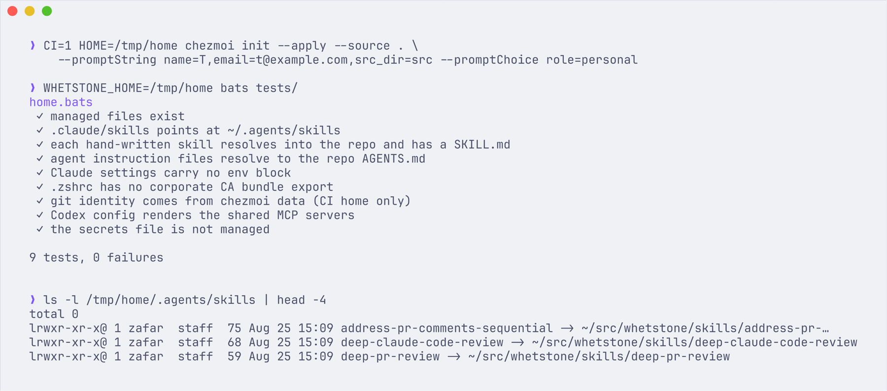

# whetstone

The repo that keeps the tools sharp: macOS dotfiles managed by chezmoi, a Copier template
for Python projects, and agent skills, subagents, and hooks for Claude Code, Codex, and
Cursor. One repo, one source of truth, tested in CI.

[](https://github.com/zaffnet/whetstone/actions/workflows/lint.yml)
[](https://github.com/zaffnet/whetstone/actions/workflows/template.yml)
[](https://github.com/zaffnet/whetstone/actions/workflows/macos.yml)
[](LICENSE)



## Four commands

```bash
# A new Mac, from nothing to a configured shell, editor, and agents.
sh -c "$(curl -fsLS get.chezmoi.io)" -- init --apply zaffnet/whetstone

# A new Python project with ruff, mypy, basedpyright, pre-commit, uv, and CI.
uvx copier copy --trust gh:zaffnet/whetstone my-project

# The agent skills alone, into Claude Code, Codex, Cursor, or any other agent.
npx skills add zaffnet/whetstone

# The skills, reviewer subagents, and hooks as Claude Code plugins.
claude plugin marketplace add zaffnet/whetstone
# then inside Claude Code: /plugin install whetstone-skills@whetstone
```

**Do not run the first command blindly.** It installs Homebrew packages, Oh My Zsh, and
writes files into your home directory. Fork the repo, read `home/.chezmoiscripts/` and
`home/dot_config/homebrew/Brewfile`, delete what you do not want, then run your fork.

## What's inside

| Area | Tool | Why |
| --- | --- | --- |
| Shell | zsh + Oh My Zsh | Default on macOS; the plugin system covers completion and suggestions without a framework rewrite |
| Prompt | Powerlevel10k, Pure style | Instant prompt, async git status, and a custom segment that shows the open PR number for the branch |
| Terminal | iTerm2 | Shell integration, split panes, and a CLI (`it2`) |
| Editor | Cursor and VS Code | Same settings file shape, so one template covers both; ruff formats on save |
| Package manager | Homebrew with a Brewfile | `brew bundle` is idempotent and the Brewfile is the inventory |
| Python toolchain | uv, ruff, mypy, basedpyright, pyrefly | uv replaces pip, venv, and pyenv; ruff owns style; three checkers because each catches what the others miss (see `docs/decisions/0004`) |
| Task runner | just | One file of recipes, readable without knowing make |
| Agent config | `~/.agents` as the single source of truth | Claude Code, Codex, and Cursor all symlink into it, so a skill is added once |
| Secrets | `~/.zsh_secrets` and `*.local` files | Exported by the shell, read by every tool, never written into a tool's own config |

## Principles

- One source of truth for agent configuration. Skills, MCP servers, and instructions live in
  `~/.agents`; each agent gets a symlink.
- Secrets live in the environment. No API key is ever stored in a settings file, and
  three scanning layers check that it stays that way (`docs/redaction.md`).
- Every config file explains its exceptions. A disabled lint rule, an unusual flag, or a
  pinned version carries a comment that says why.
- The template updates downstream. Projects created from `template/` run `copier update`
  to pull later changes instead of copying them by hand.
- The bootstrap is tested. A GitHub Actions job applies the whole tree into a fresh macOS
  runner on every push and weekly.
- Work and personal machines share one repo. The split is a `role` value and a
  `[data.work]` table in the local chezmoi config, never a fork.

## Layout

```text
home/                 chezmoi source state for $HOME (.chezmoiroot points here)
  .chezmoiscripts/    Oh My Zsh, Brewfile, macOS defaults, agent skills
  dot_agents/         ~/.agents: skills symlinks, mcp.json, plugin inventory
  dot_claude/         settings, statuslines, theme; skills and agents are symlinks
  dot_codex/          config.toml rendered from the same mcp.json
  dot_config/         git, gh, uv, commitlint, homebrew/Brewfile
  Library/            Cursor and VS Code user settings
skills/               Agent Skills (SKILL.md), installable with npx skills
agents/               Claude Code reviewer subagents
codex/agents/         The same reviewers as Codex TOML
hooks/                Claude Code hooks: ruff on edit, worktree setup
bin/                  Scripts: AI commit messages, PR descriptions, worktree cleanup
template/             Copier template for a Python project
docs/                 Handbook, decisions (ADRs), runbooks
tests/                bats assertions run against an applied home
.github/workflows/    lint, secrets, template smoke test, macOS bootstrap
```

## Keeping it current

- `just sync` pulls edited files back from `$HOME` with `chezmoi re-add` and regenerates the
  Brewfile.
- Dependabot bumps GitHub Actions, pre-commit hooks, and the tooling lockfile weekly.
- `macos.yml` and `secrets.yml` also run on a weekly schedule, so a renamed cask or a
  leaked string is caught even when nothing was pushed.

## Docs

- [New machine](docs/new-machine.md)
- [New project](docs/new-project.md)
- [Redaction and secrets](docs/redaction.md)
- [Handbook](AGENTS.md): the conventions agents and humans both read
- [Decisions](docs/decisions/)
- [Uses](docs/uses.md)

## License

[MIT](LICENSE).
